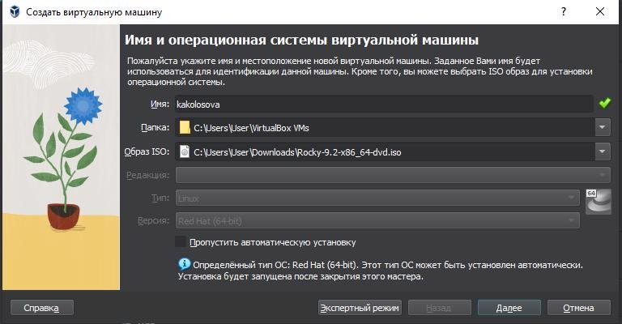
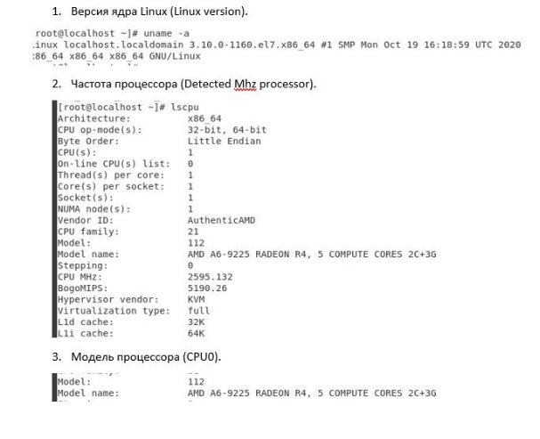
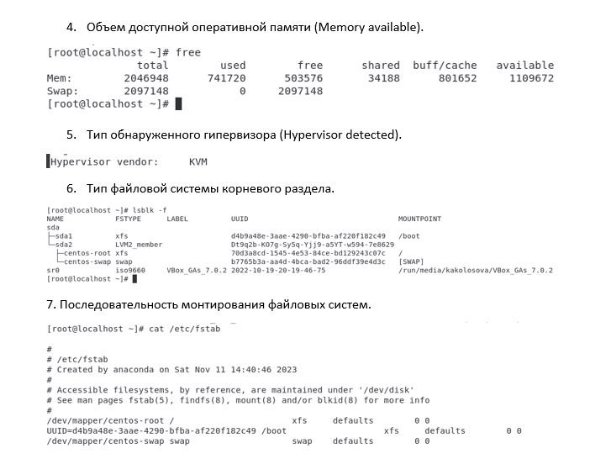
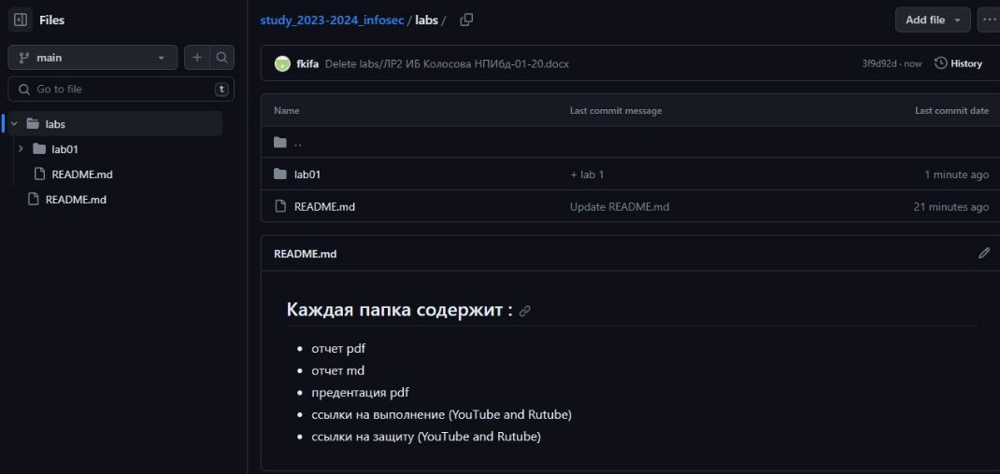
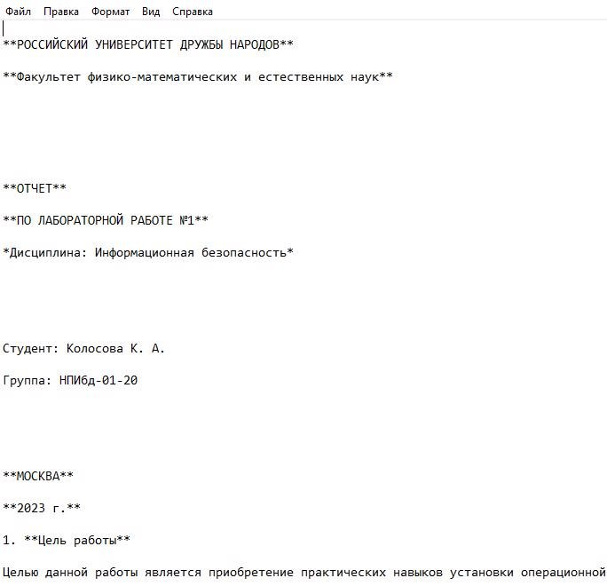

` `

**Содержание![ref1]**

- Установка и конфигурация операционной системы на виртуальную машину
- Управление версиями
- Markdown

**Создание новой виртуальной машины![ref1]**

**Основные характеристики![ref1]**

**Управление версиями![ref1]**

**Markdown![ref1]**

**СПАСИБО ЗА ВНИМАНИЕ!![ref1]**

[ref1]: Aspose.Words.c8f8d887-f2b1-41ea-814d-fd3aa55e1080.002.png
