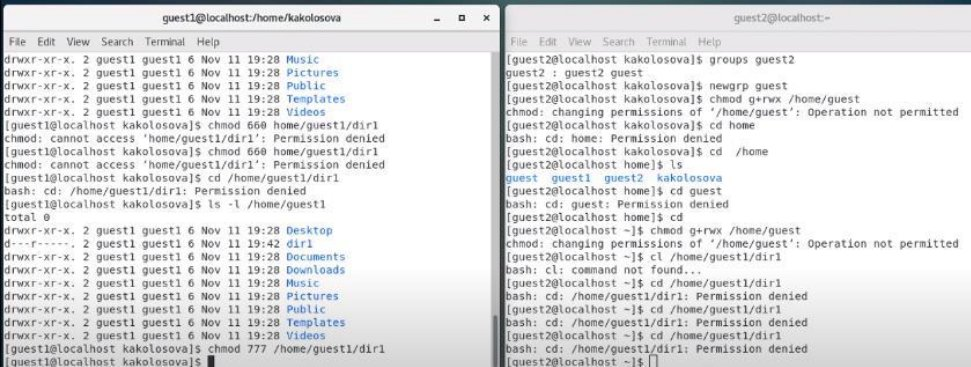

` `****

**Содержание![ref1]**

- Работа в консоли с атрибутами файлов
- Разграничение доступа в современных системах

**Подготовка![ref1]**

**Рубрика эксперименты![ref1]**

**Установленные права и разрешенные ![ref1]действия групп**

**Минимальные права для совершения операций от![ref1] имени пользователей входящих в группу**

**Вывод![ref1]**

- Получены практические навыки работы в консоли с атрибутами файлов для групп пользователей. 

**СПАСИБО ЗА ВНИМАНИЕ!![ref1]**

[ref1]: img_presentation/Aspose.Words.e6d1c012-a62c-4516-98d0-00bfb5e0cd1c.002.png
