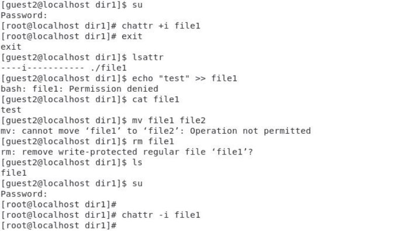

` `

**Содержание![ref1]**

- Дискреционное разграничение прав в Linux. 
- Расширенные атрибуты «а» и «i».

**Подготовка![ref1]**

**АТРИБУТ «А»**

**АТРИБУТ «i»**

**Вывод![ref1]**

- В результате выполнения работы повысила свои навыки использования интерфейса командой строки (CLI), познакомилась на примерах с тем, как используются основные и расширенные атрибуты при разграничении доступа. Имела возможность связать теорию дискреционного разделения доступа с её реализацией на практике в ОС Linux. Составила наглядные таблицы, поясняющие какие операции возможны при тех или иных установленных правах. Опробовали действие на практике расширенных атрибутов «а» и «i».

**СПАСИБО ЗА ВНИМАНИЕ!![ref1]**

[ref1]: img_presentation/Aspose.Words.57ca25d0-cb47-40cd-845e-a9e61ccb9109.002.png
